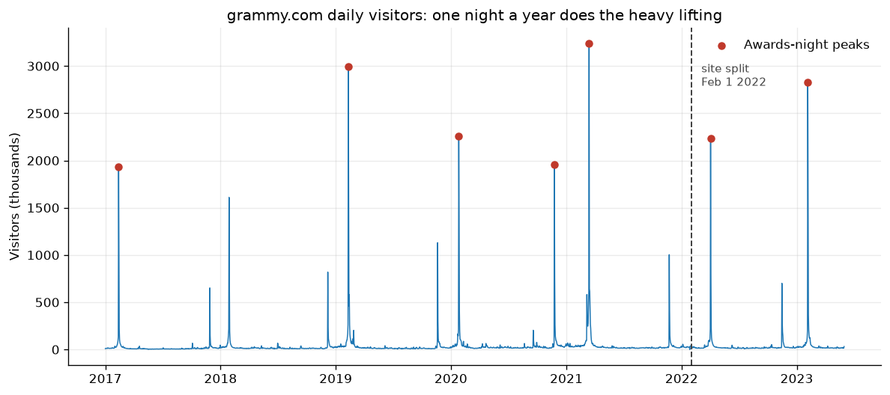
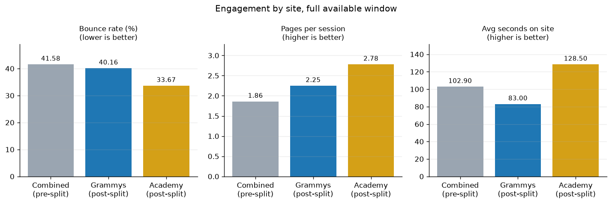
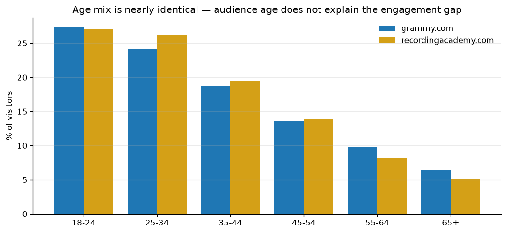

# Did splitting grammy.com and recordingacademy.com actually work?

**[Read the full analysis →](grammys-website-split-analysis.ipynb)**

The Recording Academy split one website into two on February 1, 2022: `grammy.com` for
music fans and `recordingacademy.com` for industry professionals. Leadership wanted to
know whether the split was worth keeping.

## The problem with the obvious approach

Grammys traffic is dominated by one night a year. Awards nights draw **43x** the visitors
of a regular day, and awards week alone accounts for **40–65% of annual traffic** in every
year of the data. Any before/after comparison of raw totals would mostly measure when the
ceremony fell, not whether the site improved.

So I built the analysis on three metrics that do not move with traffic volume: bounce
rate, pages per session, and average time on site. I also used the fact that tracking on
`grammy.com` never changed across the split, which makes the fan site a genuine
before/after series that can be compared against itself.

## Findings

| Finding | Evidence |
|---|---|
| Traffic is a spike, not a trend | Awards nights average 43x a regular day; awards week is 40–65% of annual traffic |
| Spike traffic is *high* quality | 34.1% bounce and 154 seconds on awards nights, vs 43.2% and 98 seconds otherwise — the problem is retention, not content |
| The split improved the fan site | Like-for-like Feb–May: bounce 42.3% → 38.8%, pages/session 1.97 → 2.20 |
| The Academy site is the stickiest property | 128.5 seconds and 2.78 pages per session, vs 83.0 and 2.25 on the fan site |
| Demographics do **not** explain the gap | Largest difference in any age bracket is 2.0 percentage points |
| Awards-season overflow hurts the Academy site | Its bounce rate rises to 45.1% in Feb–May, worse than the fan site in the same window |
| Depth is the weakness against the AMAs | Better bounce rate (40.2% vs 54.3%), far worse duration (83s vs 353s) |

## Two decisions that shaped the result

**I controlled for seasonality.** The naive before/after comparison showed time on site
*dropping* 20 seconds after the split. But the pre-split window spans five full years
while the post-split window is 16 months weighted toward awards season. Restricting both
sides to February–May showed the real picture: engagement gains are genuine but smaller,
and time on site is roughly flat rather than falling.

**I tested the stated hypothesis instead of confirming it.** The brief assumed the Academy
site serves an older, professional audience. The age data disagrees — the two sites differ
by at most 2.0 percentage points in any bracket. Reporting that mattered more than
confirming the assumption would have, because a content strategy built on a false
demographic split would target the wrong thing.

## Recommendation

Keep the sites separate, and treat them as two different jobs:

1. **grammy.com is a reach engine.** 68% mobile, weak on depth rather than appeal. Invest
   in fast mobile follow-on content to convert single-page visits into second pageviews.
2. **recordingacademy.com is a retention engine.** 1.17M sessions against the fan site's
   24.2M, but holds attention 55% longer. Judge it on depth and return visits, not volume.
3. **Fix awards-season landing pages on the Academy site** — the 45.1% seasonal bounce
   rate is the cheapest available win.
4. **Segment by intent, not age.** The audiences are nearly the same age; they differ in
   why they arrived.

## Limitations

- The Academy site has no pre-split baseline, so its numbers are cross-sectional only.
- The pre-split window is 1,857 days against 485 after; the Feb–May cut reduces but does
  not remove that imbalance.
- A single-page visit that satisfied the visitor still counts as a bounce.
- AMA figures are published aggregates I could not validate against raw data.

## Skills demonstrated

pandas (filtering, grouping, merging, concatenating, custom aggregation functions) ·
metric design for skewed data · seasonality controls · hypothesis testing ·
matplotlib · stakeholder communication · documented AI collaboration

## Data

`data/` — daily web analytics for both sites (2017-01-01 to 2023-05-31), age demographic
breakdowns, and desktop/mobile traffic splits. Provided by The Recording Academy through
the Global Career Accelerator.
