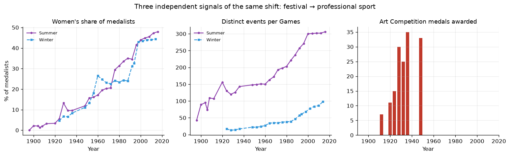
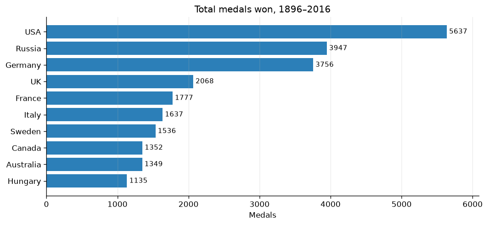

# 120 years of Olympic medalists: finding the story in the data

**[Read the full analysis →](olympic-medalists-analysis.ipynb)**

39,783 Olympic medals awarded between 1896 and 2016, and a newsroom-style brief: explore
the data, then pitch a story a general audience would actually read. There was no
predefined question, so most of the work was deciding which question was worth asking.

## Approach

I ran the standard descriptive pass but treated it as **lead generation** rather than the
deliverable. Summary statistics are candidate stories; the useful ones are the values that
do not fit expectations. Here that was the age range — a 10-year-old and a 73-year-old both
won Olympic medals — and following that outlier produced the story.

## The finding

**Five of the ten oldest medalists in Olympic history won their medals for art.**

Art Competitions were a real Olympic programme: 156 medals across seven Games from 1912 to
1948, with a mean medalist age of 42.3 against 25.9 overall. The category was abolished
after 1948 and never returned.

That reframed the dataset. The early Olympics were not a smaller version of the modern
Games — they were a different kind of event. Three independent signals confirm the same
shift:

| Signal | 1896 | 2016 |
|---|---|---|
| Art Competition medals | contested 1912–1948 | abolished |
| Women's share of medalists | 0% | 47.9% |
| Distinct events per Games | 43 | 306 |
| Countries winning medals | 10 | 86 |

The Games did not just get bigger; their purpose changed, from a broad celebration of
culture and physical life into a professionalized global sporting competition.

## Two data-quality decisions that changed the analysis

**Missingness is historical, not random.** 75.4% of 1896–1936 records have no recorded
height, against 1.7% after 1980. That killed a tempting analysis — "athletes have gotten
bigger over time" — because early-era averages would come from the unrepresentative
minority who happened to be measured. I left the nulls in place rather than imputing values
I could not justify, and reported body measurements only within single recent Games, with
sample sizes stated.

| Era | Age missing | Height missing | Weight missing |
|---|---|---|---|
| 1896–1936 | 8.3% | 75.4% | 81.3% |
| 1937–1959 | 1.0% | 62.7% | 62.9% |
| 1960–1979 | 0.1% | 2.0% | 2.6% |
| 1980–2016 | 0.0% | 1.7% | 2.1% |

**`Team` is not a country column.** It holds 498 distinct values against 136 countries, and
disagrees with the country field on 37.1% of rows — because it contains club names
(`Pistoja/Firenze`), mixed-nationality crews (`Denmark/Sweden`), and numbered squads
(`Bari-2`). Grouping by it would have split single countries across many labels, so I
dropped it and standardized on the NOC code and country name.

## Supporting analysis

The USA leads with 5,637 medals and the highest gold conversion rate of the top ten at
46.8%. Ages 10 to 73; 66 sports; 756 distinct events; 137 countries.

## Story pitch

*The Olympics used to give medals for sculpture. What we stopped rewarding says as much as
what we started rewarding.*

Everyone assumes the Olympics have always been about athletic performance. They have not.
The Games are a record of what each era thought worth celebrating, and the disappearance of
the art medal is the cleanest evidence of that change.

**Next steps if I were reporting this:** the IOC's stated reason for ending the art
competitions (amateurism rules are the likely cause, since artists sold their work), and
participation data alongside medal data, so growth in *opportunity* can be distinguished
from growth in *access*.

## Limitations

- Medal-winning entries only — "47.9% of medalists were women" is not the same as 47.9% of
  competitors.
- Team events award one medal per athlete, so team sports are over-weighted in raw counts.
- Country labels are modern, so the USSR and East Germany complicate long-run comparisons.
- Height and weight are only reliable from roughly 1960 onward.

## Skills demonstrated

Exploratory analysis · missing-data auditing by subgroup · categorical validation ·
`groupby`/`agg`/`nlargest`/`value_counts` · multi-signal corroboration · matplotlib
small multiples · data storytelling

## Data

`data/olympics.csv` — one row per medal awarded, 1896–2016, with athlete demographics,
country, sport, event, and medal type.
