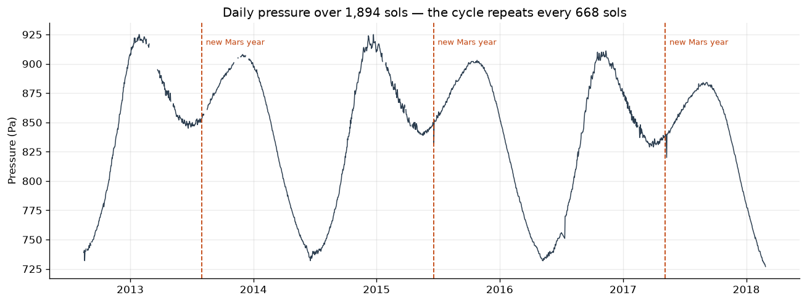
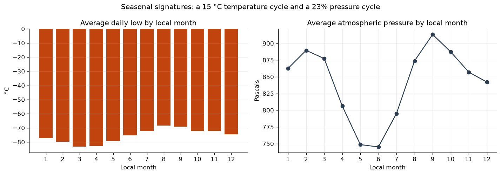

# Identifying a planet from its weather alone

**[Read the full analysis →](identifying-the-planet.ipynb)**

Six years of rover weather telemetry, 1,894 daily records, and the planet's identity
withheld. The task: work out which planet it came from using nothing but the measurements.

I like this problem because the answer is verifiable. Most analysis ends in a judgement
call; this one ends in a fact that can be checked against NASA's published orbital periods,
which makes it a genuine test of method.

## Method

A planet's clearest fingerprint in a weather log is **the length of its year**, so I worked
backwards from that:

1. Audit the data and decide what is trustworthy.
2. Measure the local day against the Earth day.
3. Measure one complete orbit.
4. Cross-check the answer against atmospheric behaviour.

## The answer

**Mars** — specifically the Curiosity rover's REMS record from 2012 to 2018.

| Measurement | This dataset | Mars (published) |
|---|---|---|
| Local day | 1.027 Earth days | 1.027 Earth days |
| Local year | 668.5 sols / **687 Earth days** | 668.6 sols / 687 Earth days |
| Pressure | 745–913 Pa | ~600–1,000 Pa, strong seasonal cycle |
| Daily low | −62 °C to −90 °C | −60 °C to −90 °C at Gale Crater |

No other planet is within 400 Earth days of the measured orbital period:

| Planet | Orbital period | Difference from measurement |
|---|---|---|
| Mercury | 88 days | −599 |
| Venus | 225 days | −462 |
| Earth | 365 days | −322 |
| **Mars** | **687 days** | **0** |
| Jupiter | 4,333 days | +3,646 |

## The measurement that made it work

The dataset includes `ls` (solar longitude), the planet's angular position in its orbit
from 0° to 360°. One full sweep is exactly one orbit, so instead of estimating a year from
seasonal patterns I detected the points where `ls` wraps from 360° back to 0° and measured
the gap: 668 and 669 sols across two complete orbits.

**My first attempt was worse, and that is worth recording.** I initially estimated the year
by averaging the lengths of the 12 labelled months, which produced roughly 660 sols. That
estimate was biased low because the first and last months in the file are truncated by the
recording window. Detecting orbital wraps avoids the boundary problem entirely, because it
never relies on partial periods.

## Independent confirmation from the atmosphere

An orbital match is strong evidence, but one line of reasoning is fragile. If this is Mars,
the weather should show two specific signatures — and it does:

- **Average daily lows of −68 °C to −83 °C** with a **63.6 °C mean daily swing**. That much
  overnight heat loss requires an atmosphere far thinner than Earth's.
- **Pressure of 745–913 Pa**, under 1% of Earth's 101,325 Pa, cycling **23% annually** as
  CO₂ freezes onto the winter polar cap and sublimates back in summer — a Mars-specific
  mechanism.
- The pressure trace repeats on the same 668-sol period the orbital analysis found, which
  independently confirms the year length.

## Data-quality decisions

| Issue | Decision | Reasoning |
|---|---|---|
| `wind_speed` 100% null | Drop the column | The anemometer never returned a reading. A column with no data cannot be imputed, and keeping it invites someone to average nothing. |
| `atmo_opacity` 99.8% constant | Drop, but note the 3 anomalies | A field with no variance cannot explain variation in anything else. |
| Temperature/pressure 1.4% null | Keep the rows | Scattered dropouts. Dropping whole rows discards good readings; imputing invents weather. |
| `month` stored as text | Convert to integer | `"Month 10"` sorts immediately after `"Month 1"`, which silently scrambles every seasonal chart. |

That last one is the kind of bug that produces a plausible-looking graph with a completely
wrong shape, which is why it is handled before any grouping.

## Limitations

- The wrap detector uses a fixed threshold (`diff < -100`); one corrupted `ls` value would
  create a false boundary. At scale I would validate each detected boundary against the
  expected spacing.
- Only two complete orbits are captured, so the year length resolves to about one sol.
- The 12 "months" are a mission convention, not a physical unit, so I used them for seasonal
  grouping but deliberately did not build the orbital measurement on them.

## Skills demonstrated

Data auditing and null-pattern reasoning · type-conversion bug prevention · cycle detection
with `diff()` · unit conversion and derived measurement · triangulating a conclusion across
independent signals · matplotlib annotation

## Data

`data/planet_weather.csv` — 1,894 sols of rover telemetry (2012-08-07 to 2018-02-27):
sol, solar longitude, local month, min/max temperature, pressure, wind speed, and
atmospheric opacity.
