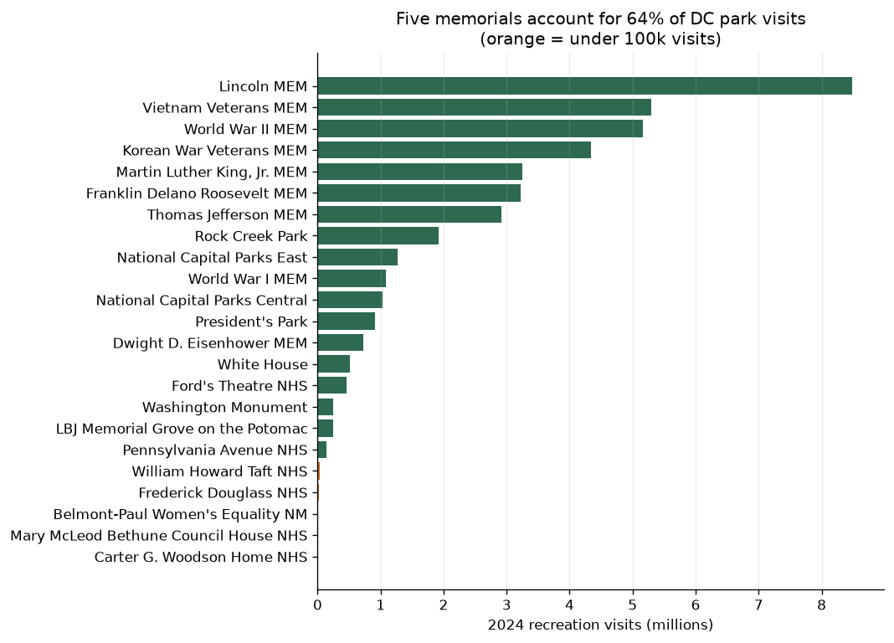
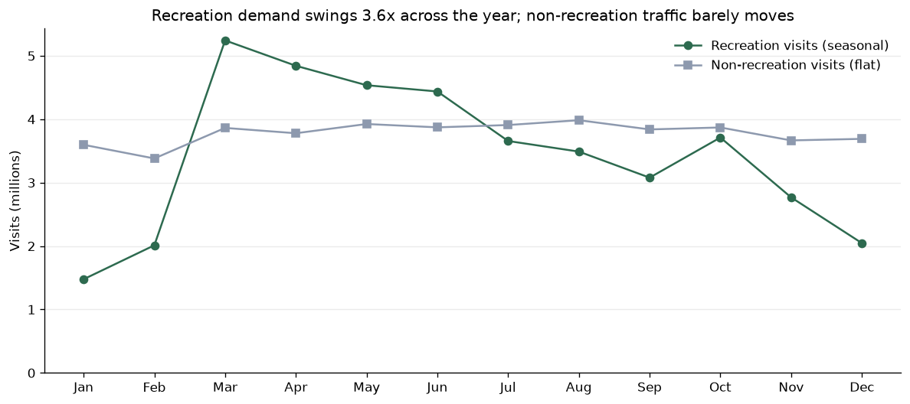

# Where should the National Park Service spend its DC campaign budget?

**[Read the full analysis →](dc-national-parks-analysis.ipynb)**

The National Park Service was planning a promotional campaign for its Washington, DC sites
and needed the 2024 visitation data checked and interpreted. The practical questions were
**where** to promote and **when**.

## Approach

A campaign has two levers, so I built the analysis around them rather than around the files:

- **Targeting** — is attention spread across the sites or concentrated in a few? That
  decides whether to amplify popular sites or redirect demand to quiet ones.
- **Timing** — is demand seasonal, and if so, is the budget better spent filling quiet
  months or reinforcing busy ones?

With only 23 sites and 12 months, the analytical risk here is not computation — it is
accepting a wrong number. So I validated the extremes rather than only summarizing the
middle.

## Findings

**Attention is extremely concentrated.** The Lincoln Memorial alone takes 20.5% of all
41.3M recreation visits; the top five sites take 64.2%; the bottom ten share 4.0%.

**There are two different demand patterns, not one.** Recreation visits swing 3.6x across
the year (March 5.24M, January 1.48M) with 79.9% falling between March and October.
Non-recreation visits stay between 3.4M and 4.0M every single month.

| | Total 2024 visits | Monthly range | Coefficient of variation |
|---|---|---|---|
| Recreation | 41,300,210 | 1.48M – 5.24M | **0.350** (strongly seasonal) |
| Non-recreation | 45,376,923 | 3.38M – 3.98M | **0.045** (essentially flat) |

That contrast is the most useful result. The 45.4M non-recreation visits are commuters and
through-traffic that a promotional campaign cannot move, so **the addressable market is the
41.3M recreation visits** — and most of those already happen in the warm months.

**Visits are short.** 0.61 recreation hours per visit, about 37 minutes. These are monument
stops on a walking route, not day trips.

## A data-quality flag, not a finding

The Carter G. Woodson Home reports **30 recreation visits for the entire year** — roughly one
visitor every twelve days, at a site in a dense neighbourhood of a major city. That is not a
small number, it is an implausible one.

I could not resolve it from this dataset, so I report it as a data-quality issue rather than
a finding: the site was most likely closed for part of 2024, or its visits are counted under
`National Capital Parks East`. Feeding it into a "least visited sites" recommendation would
have handed the client a targeting decision built on a broken counter.

By contrast, Mary McLeod Bethune Council House (3,338) and Belmont-Paul Women's Equality
(7,704) are low but plausible, so those I treat as real.

## Recommendations

1. **Promote the quiet sites through the busy ones.** Concentration is the opportunity:
   the Lincoln Memorial's 8.5M visitors are already within walking distance of sites drawing
   under 30k. Cross-promotion at high-traffic memorials moves more people than standalone
   advertising for a site nobody searches for.
2. **Run the campaign in the shoulder months — April–June and September–October.** March is
   already at capacity from cherry blossom season, and January–February demand is
   weather-limited in ways marketing cannot fix.
3. **Design for a 37-minute visit.** Short routes chaining two or three nearby sites match
   how people actually use these parks.
4. **Verify the Woodson Home figure before it reaches a decision.**

## Limitations

- One year of data, so a 2024-specific pattern cannot be separated from a stable one. The
  March spike depends on cherry blossom timing, which moves year to year.
- The site-level and monthly files cannot be joined — monthly totals are DC-wide, so I
  cannot tell whether individual sites peak in different months.
- Recreation vs non-recreation is the Park Service's own classification, and the camping and
  overnight columns are entirely zero for these urban sites.

## Skills demonstrated

Concentration and cumulative-share analysis · coefficient of variation for comparing
volatility across different scales · seasonality analysis · data-quality triage ·
derived metrics · matplotlib conditional coloring · translating statistics into budget
recommendations

## Data

`data/national_parks_recreation_visits.csv` — 2024 recreation visits for 23 DC-area sites.
`data/monthly_dc_visitors.csv` — DC-wide monthly totals for recreation and non-recreation
visits and hours. Source: National Park Service visitation statistics.
