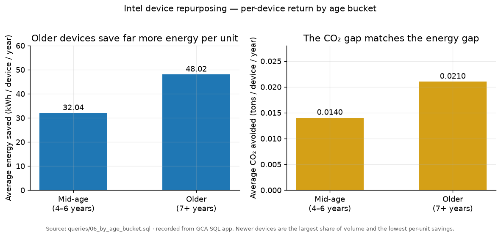
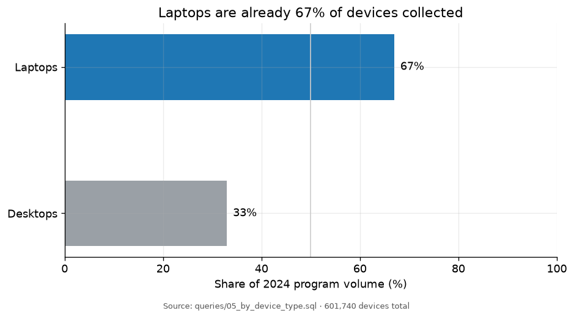
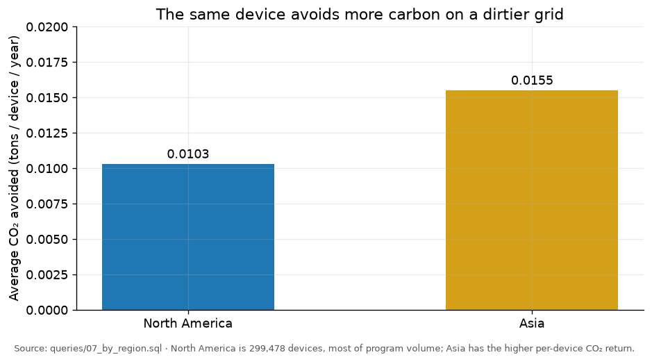

# Which repurposed devices should Intel collect next?

Intel's 2024 device-repurposing program is trying to cut energy use and CO₂ by
keeping working PCs in service instead of manufacturing new ones. The question I
was asked to answer: **which devices should the program prioritize so that the
next year's collection actually maximizes environmental return?**

The work was done in SQL against two tables — `intel.device_data` and
`intel.impact_data` — in the Global Career Accelerator's query app. The queries
in [`queries/`](queries/) are the ones I wrote. The charts below are built from
the result totals I recorded from those queries, because SQL itself does not
produce a dashboard.

```
intel.device_data                    intel.impact_data
─────────────────                    ─────────────────
device_id  (PK)  ←——————— device_id  (FK)
device_type                          impact_id (PK)
model_year                           usage_purpose
                                     power_consumption
                                     energy_savings_yr
                                     co2_saved_kg_yr
                                     recycling_rate
                                     region
```

## Why the first query is a LEFT JOIN

The grain of the analysis is **a device**, not an impact row. An inner join would
drop any device that failed to match an impact record and understate the size of
the program. I joined on `device_id` and kept every device.

```sql
SELECT *
FROM intel.device_data AS d
LEFT JOIN intel.impact_data AS i
    ON d.device_id = i.device_id;
```

[`01_join_tables.sql`](queries/01_join_tables.sql) · then
[`02_device_age.sql`](queries/02_device_age.sql) adds `(2024 - model_year)` so
age is a column I can group on.

Raw age is too granular for a strategy call — a 2018 device and a 2019 device
are not two different policies. Three buckets are enough:

```sql
CASE
    WHEN (2024 - d.model_year) <= 3 THEN 'newer'
    WHEN (2024 - d.model_year) > 3
         AND (2024 - d.model_year) <= 6 THEN 'mid-age'
    WHEN (2024 - d.model_year) > 6 THEN 'older'
END AS device_age_bucket
```

[`03_age_buckets.sql`](queries/03_age_buckets.sql). The `CASE` recomputes the
subtraction rather than referencing the `device_age` alias — this SQL dialect
does not let SELECT aliases be reused in the same SELECT list.

## The program is large. The mix is the problem.

Locked into a CTE so every later summary uses the same grain
([`04_program_totals.sql`](queries/04_program_totals.sql)):

| | Result |
|---|---|
| Devices repurposed in 2024 | **601,740** |
| Average energy saved per device | **25.74 kWh / year** |
| Total CO₂ avoided | **6,768.42 metric tons** |

Those totals are easier to judge against something familiar: 6,768 tons is
roughly **1,471 gas cars** taken off a commuter road for a year, and 25.74 kWh
per device × 601,740 devices is **15.5 million kWh**, enough to power about
**1,500 homes** for a year.

A total that large can hide a bad mix. The next three queries slice the same CTE
by device type, age, and region.

## Finding 1 — volume and savings move in opposite directions

[`06_by_age_bucket.sql`](queries/06_by_age_bucket.sql)

Newer devices are the largest share of what Intel collected. They also save the
least energy per unit. Devices 7+ years old save **48.02 kWh** and **0.0210 tons
of CO₂** each — more than double a newer unit — but they are only a small
fraction of the intake. Mid-age devices (4–6 years) sit in between: **32.04 kWh**
and **0.0140 tons**, at **264,310** devices.



That inverse relationship is the decision. Collecting whatever is easiest
inflates headcount and under-delivers on kWh. The mid-age band is the useful
compromise: high enough volume to run a program, nearly double the per-device
return of the newer machines.

## Finding 2 — laptops already do most of the work

[`05_by_device_type.sql`](queries/05_by_device_type.sql)

Laptops are **67% of program volume** and slightly better per device than
desktops. They are also the form factor corporate refresh cycles actually
produce on a 4–6 year clock. A collection strategy that chases desktops is
fighting the installed base.



## Finding 3 — where a device is deployed changes the carbon math

[`07_by_region.sql`](queries/07_by_region.sql)

North America is **299,478 devices**, most of the program. Asia is not. But a
device deployed in Asia avoids **0.0155 tons of CO₂**, about **50% more** than
the **0.0103 tons** for North America, because the same kWh offsets a dirtier
grid.



I had treated region as a volume ranking until this query. Deployment geography
is a lever, not a footnote.

The last query ([`08_region_device_share.sql`](queries/08_region_device_share.sql))
splits each region's energy and CO₂ savings by device type. Laptops dominate the
savings share in Asia, Europe, and North America, which is why the
recommendation below does not try to rebalance toward desktops.

## Recommendation

Pivot from collecting whatever is available to collecting **mid-age corporate
laptops** and routing them toward **higher-carbon-intensity grids**, especially
Asia.

1. **Target the 4–6 year laptop refresh.** That band already produced 264,310
   devices and nearly double the per-unit savings of newer hardware, without
   depending on the thin supply of 7+ year machines.
2. **Keep laptops as the default SKU.** They are already two-thirds of volume
   and the form factor a buy-back program can actually contract for.
3. **Treat deployment region as part of the savings calculation.** Sending the
   same laptop to Asia rather than North America raises the CO₂ offset by about
   half without increasing the number of devices collected.

A cost-per-ton cap would be the next control if cost data existed: refuse a
device whose refurbishment cost is high relative to the kWh and CO₂ it avoids.

## Limitations

- The tables are a Global Career Accelerator dataset designed to reflect the
  structure of Intel's real program. They are **not** Intel's confidential
  production data. The conclusions are about this dataset.
- I do not have cost, failure-rate, or residual-value columns, so the
  recommendation is an environmental-return ranking, not a P&L.
- Age buckets are a modeling choice. A 3-year / 6-year cut is readable; a
  different cut would move some devices across the mid-age line.
- Regional CO₂ differences are inferred from the impact table, not from an
  external grid-intensity feed I could audit.

## How I used AI on this project

I wrote the joins, the `CASE` buckets, the CTE, and the `GROUP BY` slices
myself in the course SQL app. I used ChatGPT in two places, both of which I
checked against the query output:

- **Scale comparisons** for 25.74 kWh and 6,768 tons — cars off the road,
  homes powered — so a non-technical reader can judge the size of the program.
- **Regional carbon intensity** as an explanation for why Asia's per-device CO₂
  savings were higher. That is the part I had not named until I asked. The
  recommendation to treat deployment geography as a lever comes from that
  conversation; the numbers it rests on come from [`07_by_region.sql`](queries/07_by_region.sql).

## Skills demonstrated

`LEFT JOIN` · derived columns · `CASE WHEN` bucketing · `WITH` CTEs ·
`GROUP BY` on type, age, and region · share-of-total with a supporting CTE ·
turning query output into a recommendation · documented AI collaboration

## Data

GCA Querying Data track, partnered with Intel. Two tables, joined on
`device_id`. The course SQL app is not public, so this folder ships the queries
and the result totals I recorded rather than a copy of the warehouse.
