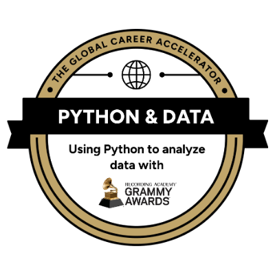
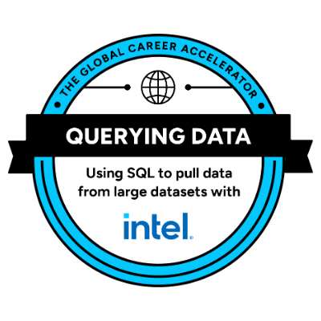

# The Global Career Accelerator: certifications and what I learned

The Global Career Accelerator is an applied, project-based program run with industry
partners. Instead of finishing with exams, each track finishes with a deliverable built on
that partner's real data — which is why the projects in this repository use Recording
Academy website analytics rather than invented sample data.

I completed four certification tracks between March and May 2026.

---

## Certifications

<table>
<tr>
<td width="140" align="center"></td>
<td>

### Python & Data — with The Recording Academy (Grammy Awards)
*Using Python to analyze data* · May 2026

Eight modules of Python and pandas, ending in a capstone analysis of the Grammys website
split for The Recording Academy.

**→ Projects [01](01-grammys-website-analytics/), [02](02-olympic-medalists/),
[03](03-mars-weather/), [04](04-dc-national-parks/)**

</td>
</tr>
<tr>
<td width="140" align="center"></td>
<td>

### Querying Data (SQL) — with Intel
*Using SQL to pull data from large datasets* · March 2026

Relational querying against large datasets: filtering, aggregation, joins across multiple
tables, and grouped summaries.

**→ Represented by the certification badge and original course credential**

</td>
</tr>
<tr>
<td width="140" align="center"></td>
<td>

### AI Professional Skills — with OpenAI
*Applying AI to real-world projects* · May 2026

Prompt design, evaluating model output against source data, and knowing which parts of a
task to delegate and which to keep.

**→ Documented in every project's "How I used AI" section**

</td>
</tr>
<tr>
<td width="140" align="center"></td>
<td>

### Intercultural Skills — with UNESCO
*Collaborating with a diverse and global team* · May 2026

Working across cultural difference: structured interviewing, comparative analysis, and
separating cultural factors from individual ones.

**→ [communication/](communication/)**

</td>
</tr>
</table>

---

## Python & Data: modules and what each one taught me

The curriculum built up in eight steps, each adding a capability the next one depended on.

| Module | Topics | Where I use it in this portfolio |
|---|---|---|
| **1. The Power of Python** | `print()`, strings and indexing, numeric types, variables, f-strings | Formatted metric output throughout, e.g. `f"{desktop_share:.2f}%"` |
| **2. Logic, Lists & Loops** | Booleans, comparison operators, built-in functions, list methods, slicing, `for` loops | Looping over site DataFrames to compute the same metrics for each (project 01) |
| **3. Dictionaries & Conditional Logic** | Key-value structures, nested dictionaries, `if`/`elif`/`else` | Organizing related values and controlling analysis paths based on data conditions |
| **LevelUp: Logic with Loops and Lists** | List comprehensions, `while` loops, `zip()` | Building chart series and label pairs (projects 01, 02) |
| **4. Intro to Pandas & Visualization** | `read_csv()`, DataFrames, `.head()`, `.loc[]`, `.info()`, `.describe()`, `.shape`, `.agg()`, plotting | The data-audit step that opens every project |
| **5. Pandas & Filtering Data** | `.loc[]` vs `.iloc[]`, boolean filters, compound conditions, `.drop()`, `.rename()`, `.sort_values()` | Splitting pre/post-split traffic; the February–May seasonality control (project 01) |
| **6. Cleaning & Summarizing Data** | `.isnull()`, `.dropna()`, `.fillna()`, `.replace()`, `.groupby()`, multi-stat `.agg()` | The null-pattern audits in projects 02 and 03 |
| **7. Pandas & Joining Data** | `pd.merge()` inner and left joins, `pd.concat()` | Joining desktop and mobile feeds; stacking age demographics (project 01) |

---

## Learning outcomes

These are the outcomes I can point to concrete evidence for, rather than a list of topics
covered.

### Python and pandas for analysis

I can take a raw CSV to a defended conclusion: audit it, clean it with documented reasons,
reshape and join it, aggregate it, and visualize the result. Across these four projects
that includes loading eight datasets, custom aggregation functions, boolean and date
filtering, `groupby` summaries, merges and concatenation, and matplotlib charts built to be
read rather than decorated.

**Evidence:** all four notebooks, executed with outputs committed.

### SQL for relational analysis

Through the Querying Data track with Intel, I learned to retrieve and summarize relational
data using filtering, aggregation, joins across tables, and grouped analysis. I retain this
as a documented learning outcome and certification rather than presenting a newly created
SQL example as one of my original portfolio projects.

### Choosing metrics that survive the data

The most useful thing I learned is that the metric has to fit the shape of the data. When
40–65% of annual traffic lands in one week, totals measure timing rather than performance,
so ratio metrics are the only honest option — and ratios must be computed as
`SUM(x) / SUM(y)`, never as an average of daily ratios.

**Evidence:** the metric design and the February–May seasonality control in
[project 01](01-grammys-website-analytics/).

### Testing a hypothesis instead of confirming it

I was told the two Recording Academy sites served different audiences by age. The data
showed a maximum gap of 2.0 percentage points, so I reported that the premise was wrong and
redirected the recommendation toward visit intent. I also abandoned an "athletes are getting
bigger" analysis after finding that 75% of pre-1936 records have no height recorded.

**Evidence:** the demographics section of [project 01](01-grammys-website-analytics/); the
missingness-by-era table in [project 02](02-olympic-medalists/).

### Separating data quality from findings

A site reporting 30 visits for an entire year is a broken counter, not a discovery. Knowing
which to flag and which to report is a judgement I now make deliberately, and I state the
limitations of every analysis rather than leaving them implied.

**Evidence:** the data-quality triage in [project 04](04-dc-national-parks/); the
`wind_speed` and `atmo_opacity` decisions in [project 03](03-mars-weather/).

### Working with AI as a copilot

I can write a prompt that produces a usable draft, and — more importantly — I can catch
what the draft gets wrong. An AI memo I generated for the Grammys project confidently
repeated a false premise that came from my own prompt, because a model cannot check a claim
against data it has never seen. Verifying the premise is the analyst's job.

**Evidence:** the "How I used AI on this project" section closing each notebook, and the
[AI disclosure](README.md#how-ai-was-used-in-this-portfolio) in the main README.

### Communicating across difference

Structured interviewing, then comparing another person's experience to my own while
distinguishing shared cultural factors from individual ones — and being careful not to
generalize from a single conversation.

**Evidence:** [communication/](communication/).

### Communicating to non-technical stakeholders

Every project ends in a recommendation a decision-maker could act on, with the reasoning
visible and the limitations stated. The audience for these projects is a VP or a campaign
planner, not another analyst.

**Evidence:** the recommendation sections of projects 01 and 04.

---

## Verifying these credentials

The badge images above are the digital credentials issued for each track. Anyone who wants
to verify them can request the credential links, or find them on my LinkedIn profile under
Licenses & Certifications.
